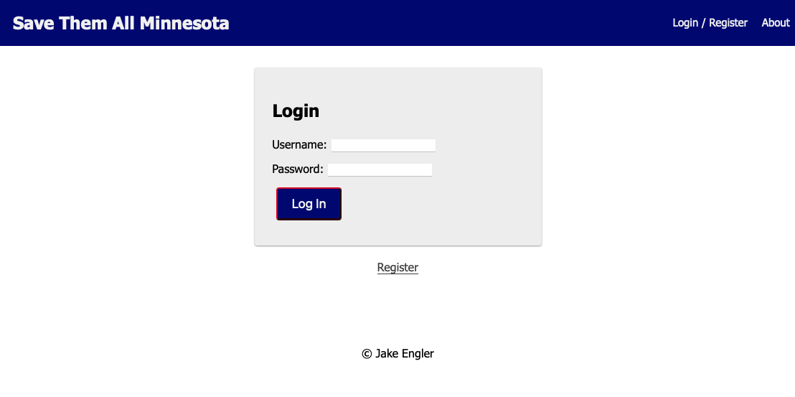
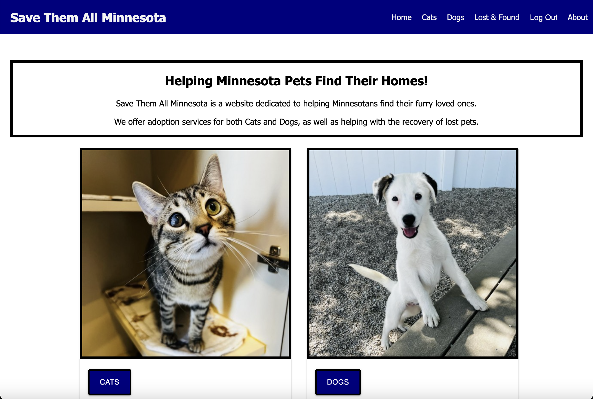
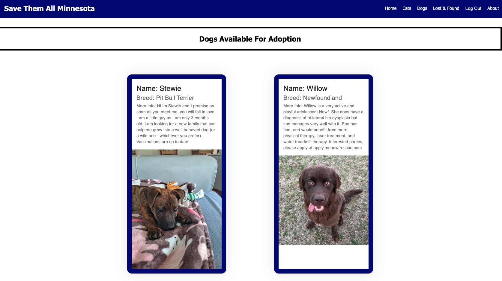
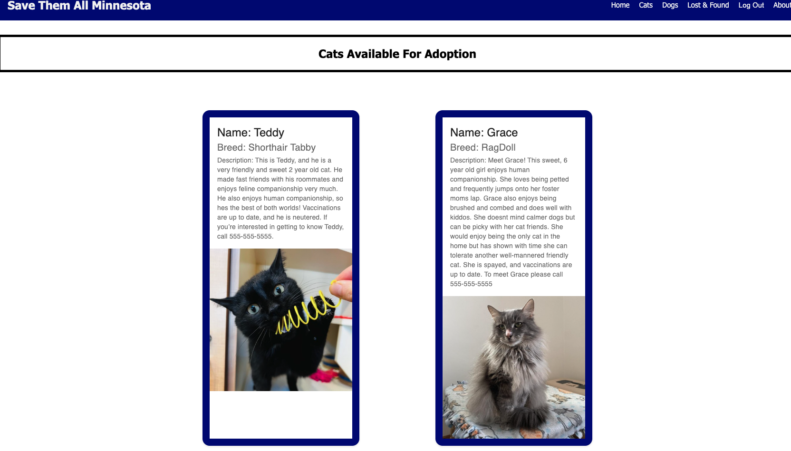
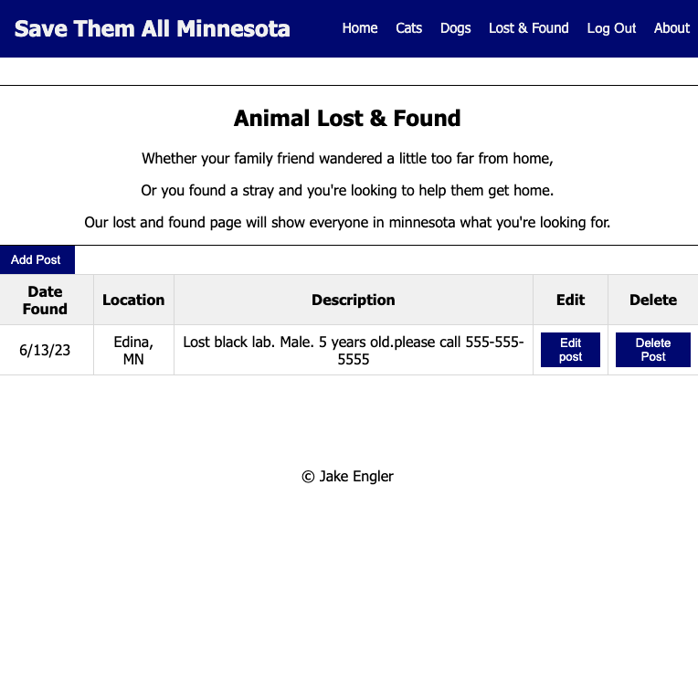

Save Them All Minnesota ReadME

## Description
For this project I created Save Them All Minnesota. A pet addoption app aimed at helping Minnesota pets find their homes.
The user will be a able to see list of both Cats and Dogs available for adoption along with a brief description of that animal.
A cool feature I added is the Lost and Found page, this allows a registered user to post to a public board if their pets has gone missing.

## Preview

